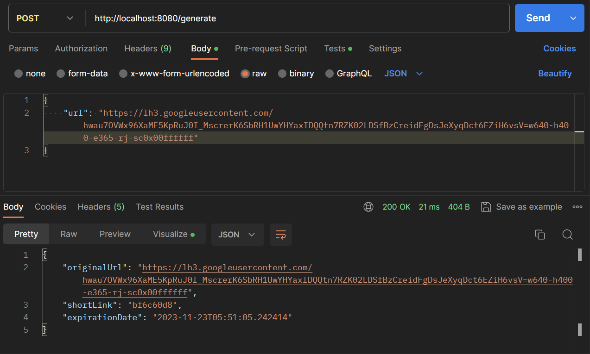

# URL-Shortener


<p align="center">
  <a href="" rel="noopener">
 </a>
</p>

<h3 align="center">URL-Shortener</h3>

<!--<div align="center">

  []() 
  [](https://github.com/kylelobo/The-Documentation-Compendium/issues)
  [](https://github.com/kylelobo/The-Documentation-Compendium/pulls)
  [](/LICENSE)

</div> -->

---

<p align="center"> A simple tool that creates and accesses shortened versions of long URLs 
    <br> 
</p>

## 📝 Table of Contents
- [About](#about)
- [Prerequisites](#prerequisites)
- [Local Setup](#local_setup)
- [How it works](#how_it_works)
- [API Endpoints](#api_endpoints)
- [Built Using](#built_using)

## 🧐 About <a name = "about"></a>

Built with Java Spring Boot, this is a powerful and efficient solution for simplifying and managing long URLs. The primary objective of the project is to provide users with a streamlined way to create concise, shareable links that redirect to the original, longer URLs. Leveraging the capabilities of Java Spring Boot, the application ensures robust performance, scalability, and security in URL shortening and redirection processes.


## 🌱 Prerequisites <a name = "prerequisites"></a>

A step by step series of examples that tell you how to get a development env running.

- Download and Install JDK based on your system

  [https://www.oracle.com/java/technologies/downloads/
  ](url)

- Install Apache Maven

  [https://maven.apache.org/download.cgi](url)


## ⚙️ Local Setup <a name = "local_setup"></a>
To use this URL shortener, you need to clone the repository from GitHub and run the application on your local machine. You will need to have Java and Maven installed on your system. You can follow these steps:

- Clone the repository using git clone 

  https://github.com/giri-10/CodeClauseInternship_URL-Shortener.git

- Navigate to the project directory using cd CodeClauseInternship_URL-Shortener

- Build the project using 
   ```
      mvn clean install
   ```
- Run the application using an IDE(IntelliJ, VScode, Eclipse)

- Open your browser and go to http://localhost:8080

- Use API testing tools like Postman to test the API endpoints


## ⚒️ How it works <a name = "how_it_works"></a>

The URL shortener application, built with Spring Boot, operates through four main components:

- Model: Defines entities like the Url class, which stores details of a shortened URL (id, alias, original URL, shortened URL, creation date, click count).

- Repository: Interfaces with the database using Spring Data JPA. It extends CrudRepository to provide methods for saving, finding, and deleting Url objects.

- Service: Handles business logic, such as generating aliases, validating URLs, encoding/decoding URLs, and updating click counts. It uses the Repository for data access and manipulation. It uses the hashing algorithm MurmurHash3 to generate aliases for long URLs.

- Controller: Manages the web layer, handling HTTP requests/responses, mapping URLs to methods, and rendering views. It uses the Service for URL shortening operations.


## 🚀 API Endpoints <a name = "api_endpoints"></a>

- ### **POST /generate**

  **Description:** This endpoint is used to generate a short URL for a given long URL. The long URL is passed as a request body parameter. The response contains the generated short URL.

  **Request Body:** A JSON object containing the long URL.

  **Response:** A JSON object containing the short URL.

  

- ### **GET /{shortUrl}**
  
  **Description:** This endpoint is used to redirect to the original long URL for a given short URL. The short URL is passed as a path parameter

  **Response:** A JSON object containing the short URL.
  
   

## ⛏️ Built Using <a name = "built_using"></a>
| Technology      | Description               |
|------------------|---------------------------|
| Java             | Programming Language     |
| Spring Boot      | Server Framework         |
| Maven            | Dependency Management    |
| H2               | Database                  |
| Postman          | API Testing Tool          |
| IntelliJ         | IDE                       |


